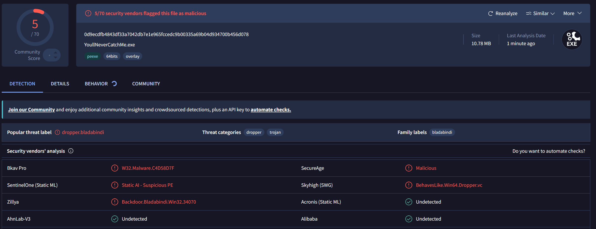

# Frequently Asked Questions

**Q: Is this app a virus?**
A: No, the app is not a virus. but the detections shown in this image are false positives, VirusTotal sometimes detects PyInstaller executables. Here is the full proof.

**Q: Can I run it on ChromeOS?**
A: You absolutely can, but you have to enable Linux development environment for it, and after you enable that in your ChromeOS settings. use the setup.sh file.

**Q: Can I modify the source code?**
A: Yes, but you have to credit the original owner for your modified version of this app.
